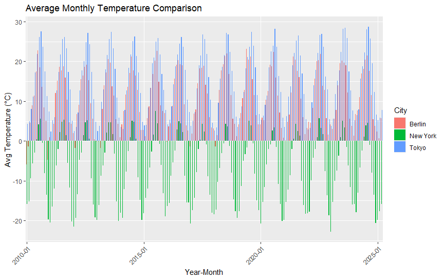
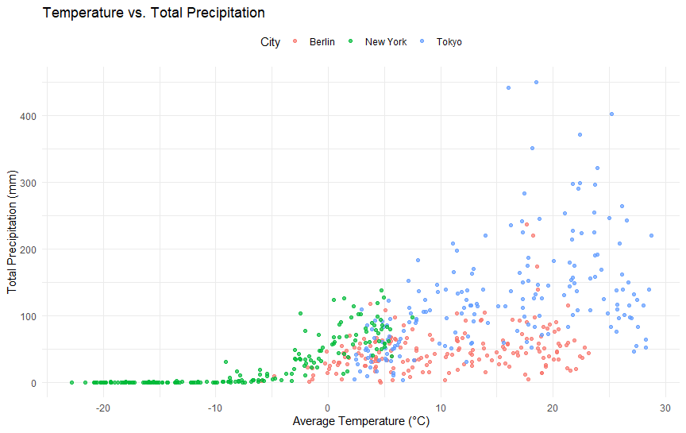
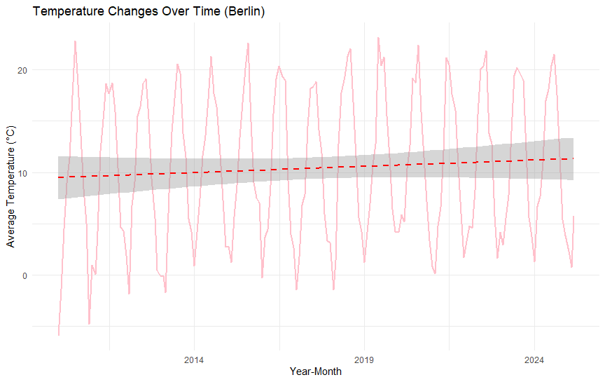
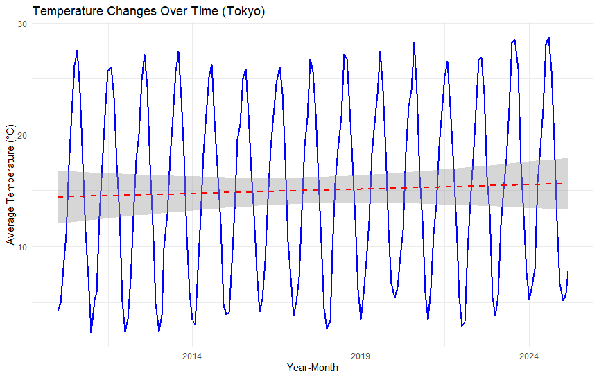
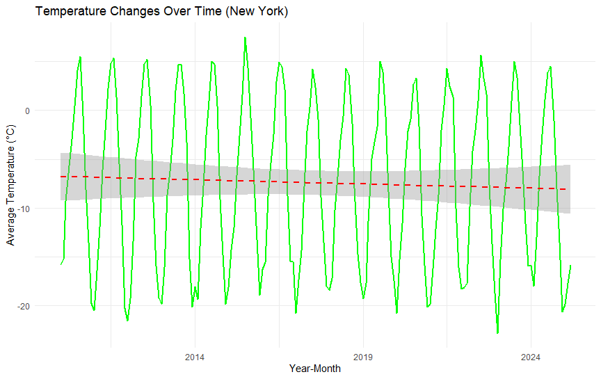

# WeatherDataViz

## Overview

This project visualizes weather data (rainfall and temperature) for three major cities: **Berlin, Tokyo, and New York**. The dataset spans from **January 1, 2010, to yesterday**, providing insights into climate patterns over time.

The analysis includes:

- **Grouped Bar Chart**: Comparing monthly average temperatures.
- **Scatter Plot**: Examining the relationship between temperature and total precipitation.
- **Line Charts**: Tracking temperature trends for each city over time.

## Data Source

The weather data is retrieved using the **Open-Meteo API**, which provides historical weather data.

- Weather data by Open-Meteo.com ([https://open-meteo.com/](https://open-meteo.com/))
- Data is offered under **Attribution 4.0 International (CC BY 4.0)** ([License](https://creativecommons.org/licenses/by/4.0/)).

## Visualizations

### 1. Grouped Bar Chart - Monthly Average Temperature Comparison

This chart allows us to observe:

- **New York has colder winters compared to the other cities.**
- **Tokyo, while having a similar climate to Berlin, experiences hotter summers.**

### 2. Scatter Plot - Temperature vs. Total Precipitation

Key observations:

- **Tokyo receives the most rainfall among the three cities.**
- **Tokyo also shows higher temperature variations compared to Berlin.**

### 3. Individual Line Charts - Temperature Trends Over Time
For each city, a time series line plot tracks the change in temperature over the years:

- **Berlin and Tokyo show a rising trend in temperature.**
- **New York, on the other hand, exhibits a decline in temperature over the years.**

#### Berlin


#### Tokyo


#### New York



## Requirements

To run this project, you need the following R packages:

```r
install.packages(c("httr", "jsonlite", "dplyr", "lubridate", "ggplot2"))
```

## Running the Code

1. Clone this repository:
   ```sh
   git clone https://github.com/dean295546/WeatherDataViz.git
   cd WeatherDataViz
   ```
2. Open the R script and run it in **RStudio** or another R environment.
3. The script will fetch the data and generate the visualizations.

## Author

Created by **Dean** as part of a data visualization project in R.

## License

- This project is licensed under the **MIT License**.
- The Open-Meteo API source code is open-source under the **GNU Affero General Public License Version 3 (AGPLv3)** or later ([License](https://github.com/open-meteo/open-meteo/blob/main/LICENSE)).

